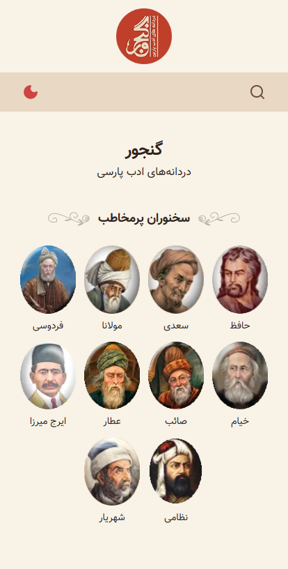
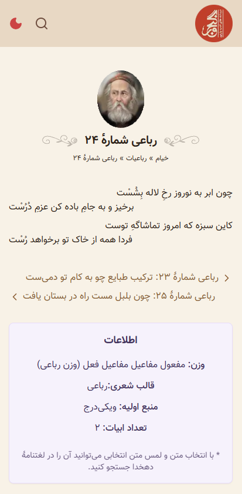
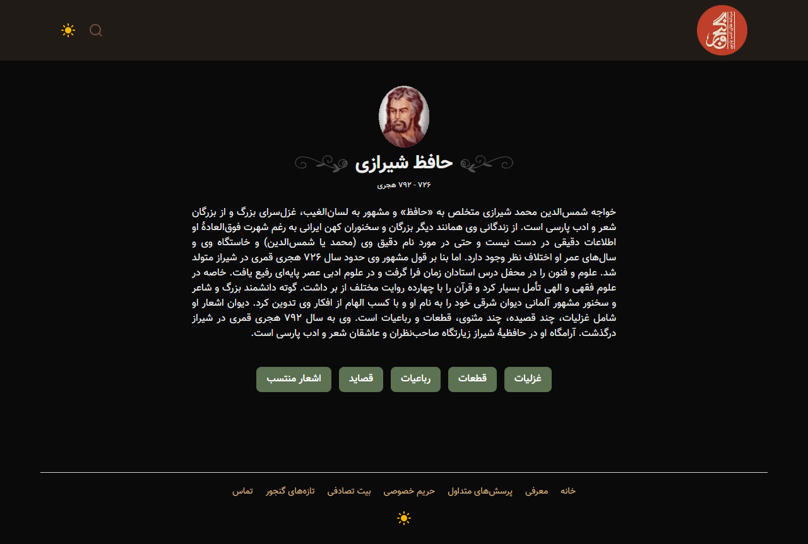

# Ganjoor PWA

A modern Progressive Web App built with Next.js for browsing Persian poetry, focused on performance, SEO, offline support, and user experience.

## Demo

* Live: https://ganjoor-pwa.netlify.app

## Preview

<p align="center">
    
  
</p>


## Highlights

- Built with Next.js App Router
- Progressive Web App with offline support
- React Query infinite search
- Optimized for SEO and Core Web Vitals
- XML sitemap and robots.txt
- Responsive UI with Tailwind CSS

## Features

* Browse poets and poems
* Full-text search with infinite scrolling
* Responsive design
* Progressive Web App (Installable)
* Offline support
* Image caching with Cache First strategy
* Static page precaching
* XML Sitemap & robots.txt
* Optimized metadata for SEO
* Skeleton loading states
* High Lighthouse scores

## Tech Stack

* Next.js (App Router)
* React
* TypeScript
* React Query
* Tailwind CSS
* Service Worker
* PWA
* REST API

## Performance

Lighthouse

* Performance: 99–100
* Accessibility: 100
* Best Practices: 100
* SEO: 100

GTmetrix

* Grade: A
* Performance: 96%
* Structure: 99%

## Project Structure

```text
app/
components/
lib/
hooks/
types/
public/
```

## API

Powered by the Ganjoor API.

## Getting Started

```bash
npm install
npm run dev
```

## License

MIT
